## Inicio

[Bastián Olea Herrera]{.subtitulo}

[bastianolea.rbind.io](https://bastianolea.rbind.io)

:::: {.pad}
Encuentra todo sobre el curso [en este post](https://bastianolea.rbind.io/blog/curso_gratis_r_intro_2/) de mi blog.
::::

:::: {.pad style="max-width: 50%;"}
::: {.boton}
[ Curso](https://bastianolea.rbind.io/blog/curso_gratis_r_intro_2/)
:::

::: {.boton}
[ Código](https://github.com/bastianolea/curso_intro_R_gratis_v2)
:::

::: {.boton}
[ Grabaciones](https://bastianolea.rbind.io/blog/curso_gratis_r_intro_2/#streaming)
:::

::: {.boton}
[ Diapositivas](https://bastianolea.github.io/curso_intro_R_gratis_v2)
:::

::: {.boton}
[ Contacto](https://bastianolea.rbind.io/contacto/)
:::
::::

:::: {.pad}
Puedes encontrar más contenidos para [aprender R en este sitio](https://bastianolea.github.io/aprende_r/), y más cosas de R [en mi sitio web](https://bastianolea.rbind.io).
::::

----


## ¿Qué es R?

:::: {.columns}

::: {.column width="55%"}
R es un lenguaje de programación enfocado al **análisis de datos**, las **estadísticas** y la **visualización de datos**.
:::

::: {.column width="45%"}
{.rosa style="height: 180px; margin-top:-30px;"}
:::
::::

::: {.boton style="margin-top:-20px; margin-bottom:-30px;"}
[ Descargar R](https://cran.r-project.org/)
:::

<br>

:::: {.fragment}
### ¿Para qué sirve?

::: {.incremental}
- Para procesar, limpiar, y analizar datos
- Crear gráficos, tablas, mapas, y otros resultados visuales
- Repetir, mejorar, adaptar y reutilizar lo que ya has hecho ♻️
- Automatizar tareas repetitivas 🤖
- Expandir tus resultados con aplicaciones, sitios web, APIs, y más 🚀
:::
::::

----


### ¿Por qué usar R?

:::: {.fragment}
::: {.cuadro} 
[Gratuito]{.subtitulo}

R es un lenguaje de programación abierto y gratuito, y es parte de la comunidad del _software libre_, así que nunca tendrás que pagar nada!
:::
::::

:::: {.fragment}
::: {.cuadro} 
[Amigable]{.subtitulo}

R fue creado para personas de distintas disciplinas, y al centrarse en los datos resulta [más intuitivo](https://bastianolea.rbind.io/blog/r_introduccion/por_que_r/#usabilidad) que otros lenguajes.
:::
::::

:::: {.fragment}
::: {.cuadro} 
[Reproducible]{.subtitulo}

La gracia de R es [guardar todos los pasos de tu análisis](https://bastianolea.rbind.io/blog/2025-11-13/), lo que facilita corregirlos, [reutilizarlos](https://bastianolea.rbind.io/blog/r_introduccion/por_que_r/#procesos-reutilizables) para nuevos casos, y compartirlo con otros.
:::
::::

----


## ¿Qué se puede hacer con R?

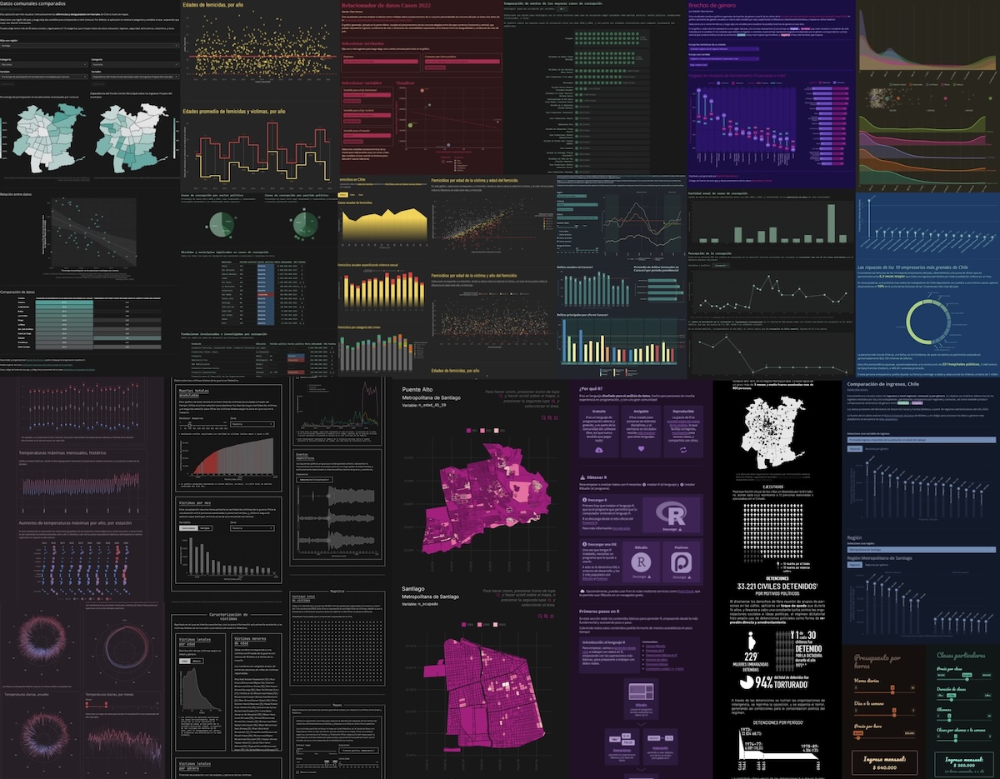

<div style="text-align: center; font-size: 90%;">
Muestra de algunas [aplicaciones](https://bastianolea.github.io/shiny_apps/), [gráficos](https://bastianolea.rbind.io/tags/gráficos/), [tablas](https://bastianolea.rbind.io/tags/tablas/), y [mapas](https://bastianolea.rbind.io/tags/mapas/) hechos con R. También algunos [trabajos](https://bastianolea.rbind.io/blog/portafolio_trabajos_r/) que he hecho.
</div>


----


## Diferencia entre _hacer_ y programar

::: {.incremental}
- Aprender a programar es un **cambio de perspectiva**: pasamos de _hacer_ cosas a _planificar_ cosas 💅🏼
- Acción 🔧 → instrucción 🧠
- Trabajamos **desde arriba**, viendo todos sus pasos y componentes 👩🏻‍💻
- Pasos independientes, reutilizables, mejorables, intercambiables ⚙️
- El trabajo que hagas puede **servirte** a futuro, a ti y a otrxs ♻️
- Resultados **replicables** 🏭
:::


----


## Conceptos clave

::: {.fragment}
{.izq style="margin: 10px; width: 110px;"}

#### Script

Archivo de texto .R en el que escribimos nuestro código, en pasos, y siguiendo un orden lógico.

<br>
:::

::: {.fragment}
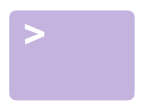{.izq style="margin-top: 10px; width: 130px;"}

#### Consola

Es la forma directa de interactuar con R, un comando a la vez, con resultados efímeros.

<br>
:::

::: {.fragment}
{.izq style="width: 130px;"}

#### Proyecto

Archivo .Rproj que marca nuestro espacio de trabajo: una carpeta específica que reúne todas las piezas de nuestro análisis.
:::


# RStudio

::::: {.columns}

:::: {.column width="55%"}

RStudio es una IDE (entorno de desarrollo integrado) que nos permite escribir código en R de forma más cómoda, organizada, y visual.

::: {.incremental}
- Entorno de desarrollo integrado (IDE) enfocado en R
- Lanzado en 2011
- Software libre (licencia de código abierto AGPL)
:::

::: {.boton .fragment}
[ Descargar RStudio](https://posit.co/download/rstudio-desktop/)
:::

::::

:::: {.column width="45%"}
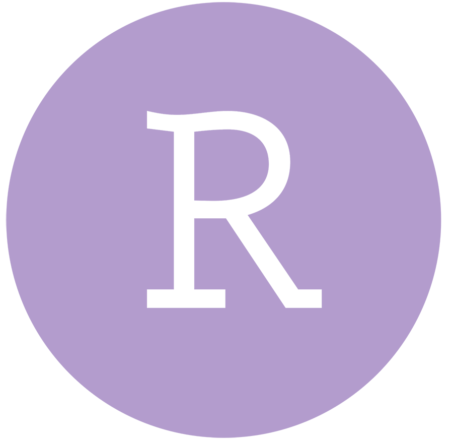{.rosa style="height: 200px; margin-top:-36px;"}
::::

:::::


----

## Paneles de RStudio

::: {.boton .absolute top=-1% right=0%}
[ Descargar RStudio](https://posit.co/download/rstudio-desktop/)
:::

{.entrada-fade-in .centro style="width: 800px;"}

::: {.fragment}
[1]{.circulo-grande .absolute top=30% left=4%}
[Scripts]{.circulo-grande-texto .absolute top=30% left=4%}
:::

::: {.fragment}
[2]{.circulo-grande .absolute top=70% left=4%}
[Consola]{.circulo-grande-texto .absolute top=70% left=4%}
:::

::: {.fragment}
[3]{.circulo-grande .absolute top=30% right=4%}
[Entorno]{.circulo-grande-texto-der .absolute top=30% right=4%}
:::

::: {.fragment}
[4]{.circulo-grande .absolute top=70% right=4%}
[Archivos]{.circulo-grande-texto-der .absolute top=70% right=4%}
:::

----


### Conceptos

::: {.fragment .pad}
[1]{.circulo} **Panel de scripts:** los archivos de texto con nuestro código. Podemos tener varias pestañas. Ejecutamos el código poniendo el cursor en la línea y presionando `control + enter`, o el botón _Run_.
:::

::: {.fragment .pad}
[2]{.circulo} **Panel de consola:** en la consola se imprimen los **resultados** del código que ejecutamos. También podemos ejecutar código directamente en ella escribiendo y presionando `enter`.
:::

::: {.fragment .pad}
[3]{.circulo} **Panel de entorno:** acá veremos los **objetos** que vayamos creando o cargando, que pueden ser números, texto, tablas de datos, funciones, gráficos y otros.
:::

::: {.fragment .pad}
[4]{.circulo} **Panel de archivos:** en este panel podemos navegar los archivos y carpetas de nuestro proyecto y/o computador. La idea es que _todo_ esté dentro del proyecto!
:::


----

### Consola y scripts


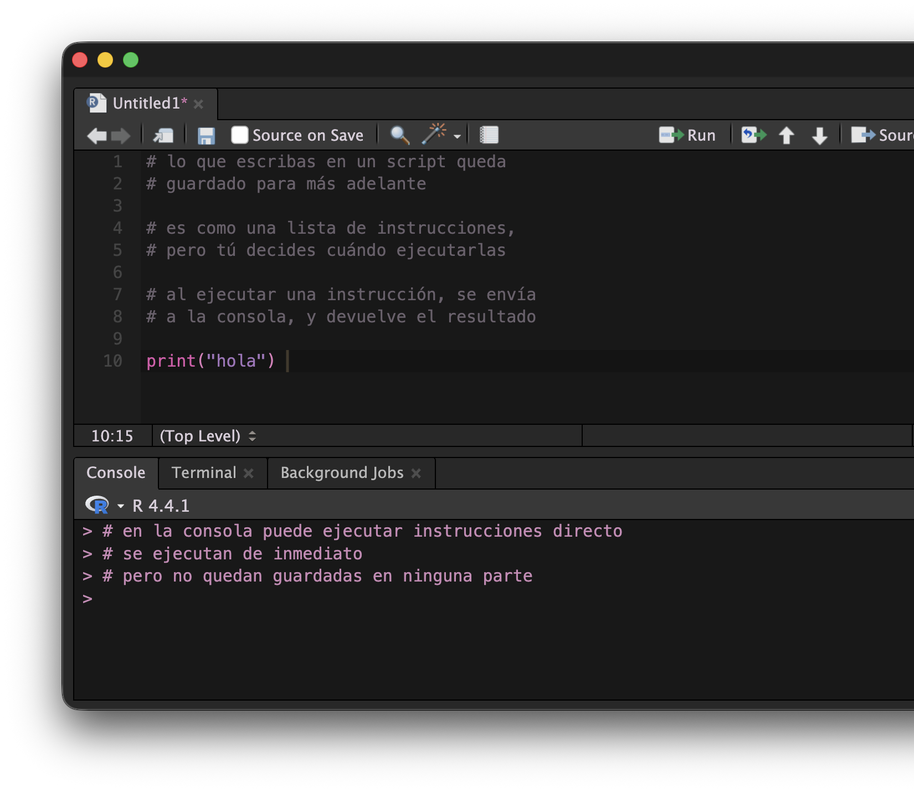{.absolute top=5% right=-20%}


:::: {.columns}

::: {.column}

::: {.incremental}
- Todos los **comandos** se ejecutan por medio de la consola
- Pero al ejecutar código en la consola, el código no se guarda!
- Para **guardar** el código, escribimos en **scripts**
- Escribimos las **instrucciones** en un script, y RStudio se encarga de pasarlos a la consola y ejecutarlos cuando se lo pidamos 💡
:::

:::
::::

----

### Botones 

::::{.r-stack}

::: {.fragment .fondo}
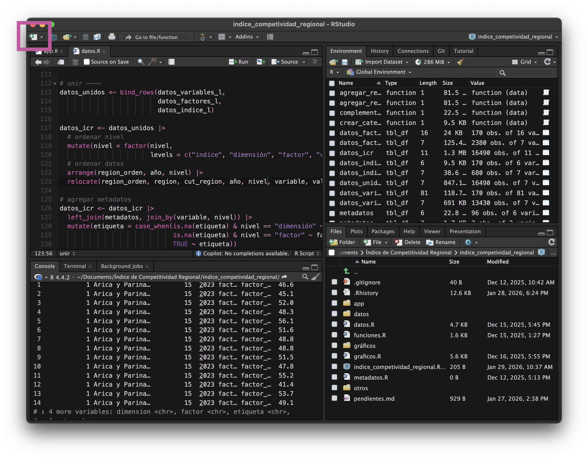{style="width: 700px;"}

::: {.centrar}
Crear un **nuevo script** de R
:::
:::


::: {.fragment .fondo}
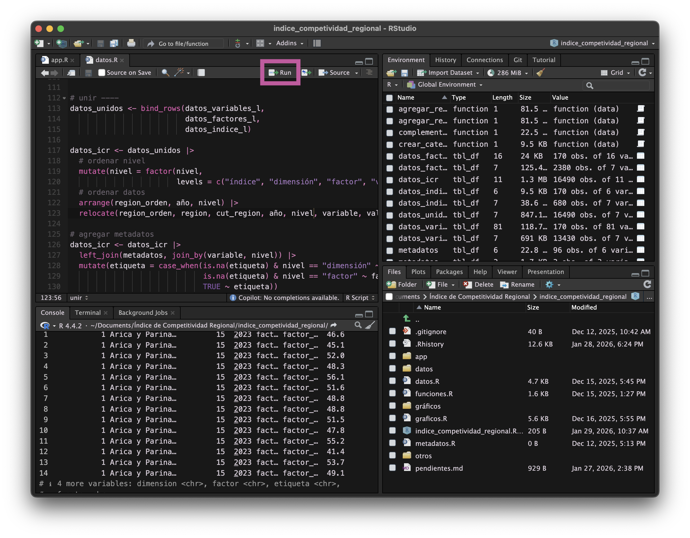{style="width: 700px;"}

::: {.centrar}
Botón para **ejecutar código**
:::
:::

::: {.fragment .fondo}
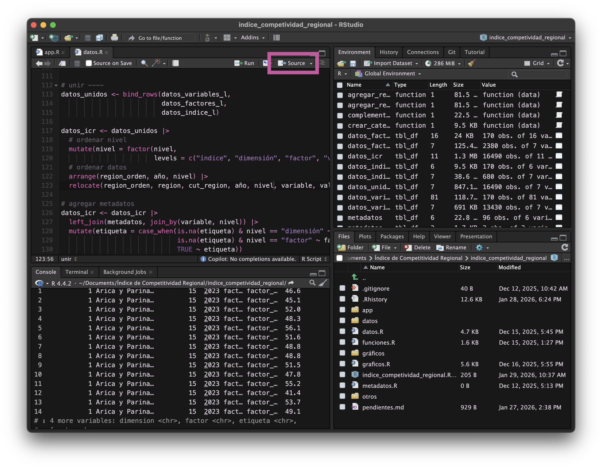{style="width: 700px;"}

::: {.centrar}
Botón para **ejecutar todo el script**
:::
:::

::: {.fragment .fondo}
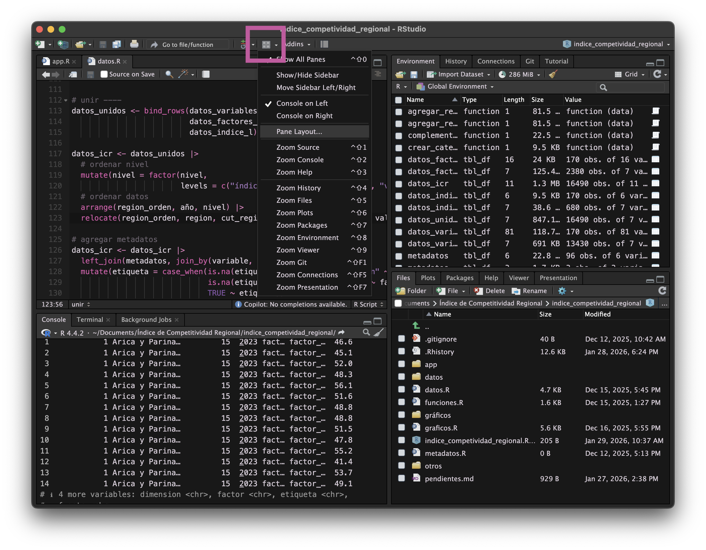{style="width: 700px;"}

::: {.centrar}
Configurar paneles de RStudio
:::
:::

::: {.fragment .fondo}
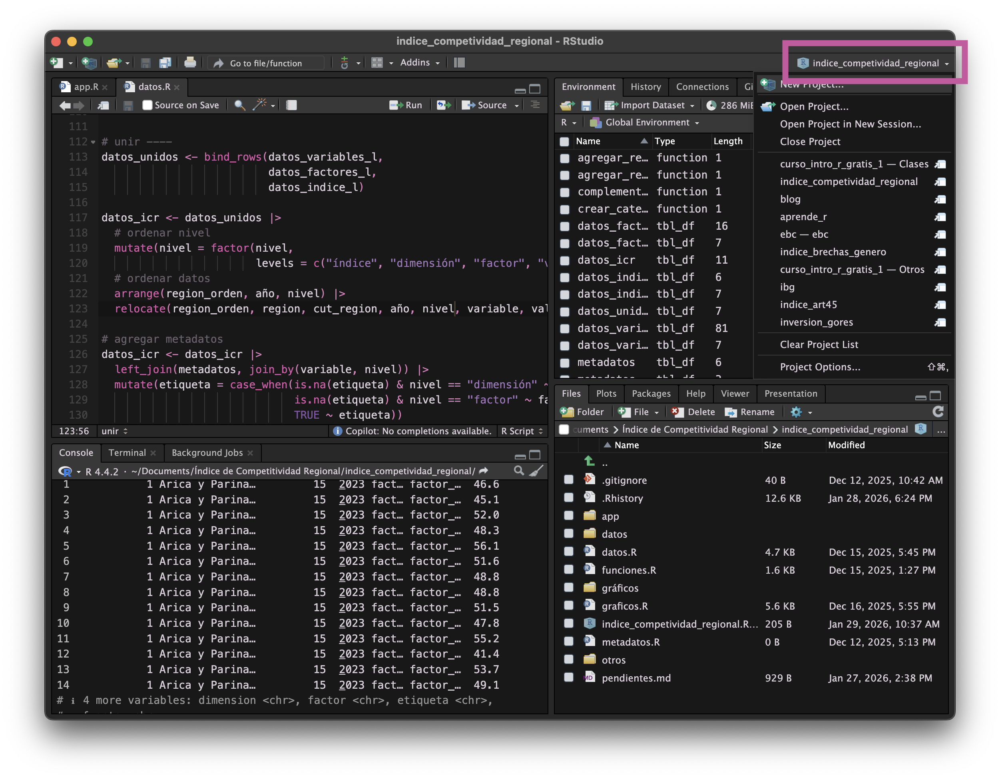{style="width: 700px;"}

::: {.centrar}
Cambiar de **proyecto** o crear uno nuevo
:::
:::

::::


# Introducción a R


::::: {.columns}

:::: {.column width="55%"}

Veamos ahora los **elementos más básicos** del lenguaje R, para luego avanzar a su aplicación al **análisis de datos**.

::: {.boton .fragment}
[ Guía de aprendizaje](https://bastianolea.github.io/aprende_r/#basico)
:::

::::

:::: {.column width="45%"}
{.rosa style="height: 200px; margin-top:-36px;"}
::::

:::::


----


## Operaciones básicas

::: {.boton .absolute top=0% right=0%}
[ Ver tutorial](https://bastianolea.rbind.io/blog/r_introduccion/r_basico/#primeras-operaciones-en-r)
:::


::::: {.columns}

:::: {.column style="padding-right:28px;"}

::: {.incremental}
- Podemos realizar cualquier operación matemática en R.
- Para **ejecutar** un comando, pon el cursor de texto en la línea o expresión que desees ejecutar, o selecciónala, y presiona el botón _Run_, o las teclas `control + enter`.
- Lo importante es que el cursor de texto `|` esté en cualquier lugar de la línea.
- El **resultado** de todas las operaciones aparece en la **consola**.
:::

::::

:::: {.column width="40%"}

::: {.fragment} 

::: {.pad}
```{r}
2 + 2 #suma
```
:::
::: {.pad}
```{r}
50 * 100 #multiplicación
```
:::
::: {.pad}
```{r}
4556 - 1000 #resta
```
:::
::: {.pad}
```{r}
6565 / 89 #división
```
:::
::: {.pad}
```{r}
10^4 #potencias
```
:::
:::

::::
:::::


----

### Comentarios

::: {.incremental}
- Los comentarios nos permiten poner texto en cualquier parte del script sin que afecte los cálculos.
- También podemos poner un comentario al final de una línea sin que afecte el código
:::


::: {.fragment}
```{r}
#| eval: false
1 + 1 + 1 + 1
# comentario: quizás esto debería
# ser de otra forma, porque
# la verdad quedó bien mal...

1 * 4 # así queda mucho mejor
```
:::

----


## Tipos de datos

Lo que podemos hacer siempre va a depender del **tipo** de cada objeto. 

. . .

En R existen varios tipos:

::: {.pad}
**Numéricos**
```{r}
#| eval: false
#| code-line-numbers: false
1  2  3  4  5.1  5.2  5.333
```
Pueden ser decimales (_doubles_) o enteros (_integers_)
::: 

. . .

::: {.pad}
**Caracter** (texto)
```{r}
#| eval: false
#| code-line-numbers: false
"ésta es una cadena de texto"
```
::: 

. . .

::: {.pad}
**Lógicos** (verdadero o falso)
```{r}
#| eval: false
#| code-line-numbers: false
TRUE FALSE TRUE
```
::: 


----

## Objetos

Se le llama **objeto** a cualquier dato, variable, o elemento que tengas en R.

Podemos guardar _todo_ como un objeto.

. . . 

Para **crear** un objeto, simplemente le damos un nombre y le _asignamos_ un contenido.

::: {style="max-width: 300px; margin: auto;"}
**nombre** [←]{style="font-size: 130%;"} _contenido_
:::

<br>

. . . 

:::: {.columns}
::: {.column .just-der }
Para asignar algo a un objeto, usamos el operador `<-`
:::

::: {.column}
```{r style="margin-left: 28px; margin-top:20px;"}
#| code-line-numbers: false
cifra <- 4
```
:::
::::

<br>

. . . 

:::: {.columns}
::: {.column .just-der}
El objeto `cifra` se crea cuando declaramos que va a contener el valor `4`
:::

::: {.column}
```{r style="margin-left: 28px; margin-top:20px;"}
#| code-line-numbers: false
cifra
```
:::
::::


----

### Asignación

::: {.boton .absolute top=0% right=0%}
[ Ver tutorial](https://bastianolea.rbind.io/blog/r_introduccion/r_basico/#asignaciones)
:::


Con el _operador de **asignación**_ creamos objetos nuevos.

::: {.centrar style="font-size: 200%"}
`->`
:::

::: {.fragment}
Se escribe con: 

::: {.centrar style="color: #563A74; opacity: 40%;"}
Windows:
:::

{.centrar}

::: {.centrar style="color: #563A74; opacity: 40%; margin-top:32px;"}
Mac:
:::

{.centrar}

:::

----


:::: {.columns}

::: {.column}
Al asignar algo, **creamos** o **modificamos** un objeto con el valor que le estamos asignando.

Al ejecutar un objeto, obtenemos su valor.
:::

::: {.column}

::: {.fragment}
```{r}
edad <- 32
edad
```
:::

::: {.fragment}
```{r}
animal = "gato"
animal
```
:::

:::
::::

<br>

::: {.fragment}
:::: {.columns}

::: {.column width=40%}

<div style="padding-right:12px;">
Podemos usar el objeto creado para lo que queramos.

Crear objetos es como **asignar variables**, y podemos usar estas variables para llevar a cabo operaciones!
</div>

:::

::: {.column width=60%}


:::: {.columns}

::: {.fragment .column width=49%}
```{r}
edad <- 32
año <- 2026
año - edad
```
:::

::: {.fragment .column width=49%}
```{r}
perros = 2
gatos = 3
perros + gatos
```
:::
::::

::: {.fragment}
```{r}
presupuesto = 100000
pizza = 15000
presupuesto - pizza * 10
```
:::
:::
::::

:::

----


## Vectores

Los vectores son **secuencias** de elementos. Un objeto que contiene cero o más datos.

::: {.incremental}
- Estos elementos son de un **mismo tipo**: numérico, carácter o lógico.
- Son la forma más básica de registrar e interactuar con varios datos a la vez.
:::

::: {.fragment}
```{r}
c(1, 2, 3, 4, 5, 6)
c("a", "b", "c", "d")
c(TRUE, FALSE, FALSE)
c(0.2, 0.1, -0.0, -0.1)
```
:::

----


También podemos realizar **comparaciones** sobre los valores de un vector:

```{r}
edades <- c(54, 34, 65, 21, 32)
edades > 40
```

<br> 

O cualquier **operación** sobre sus elementos:
```{r}
año <- 2026
años <- año - edades
años
```


----


## Paquetes

:::: {.columns} 

::: {.fragment .column width=60%}
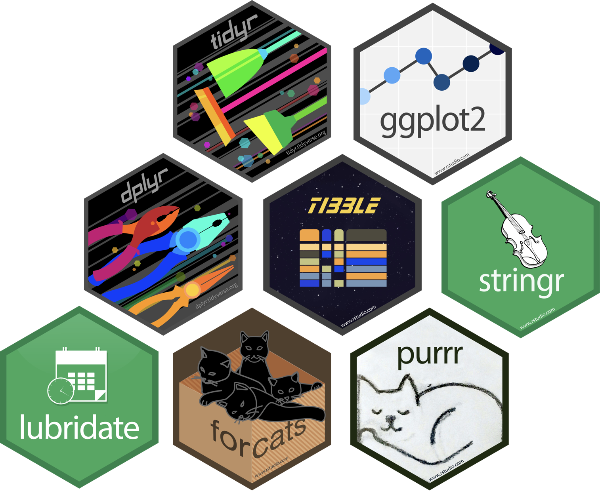
:::

::: {.column width=40%}

::: {.incremental}
- **Extensiones** de R que te permiten agregar **nuevas** y **mejores** funcionalidades.
- Se instalan desde internet
- Son creados y mantenidos **por la comunidad**
- Se revisan para garantizar su seguridad y estabilidad
:::

::: {.fragment}
```{r}
#| eval: false
#| code-line-numbers: false
install.packages()
```
:::

:::

::::


# Datos 

Para cargar datos, tenemos que:

::: {.incremental}
- Tener un **archivo** y conocer su **formato** (Excel, Stata, CSV, etc.)
- [Saber **dónde está** el archivo en nuestro computador]{.fragment .strike}
- **Guardar** el archivo dentro del proyecto de R 📂
- Conocer una **función** y posiblemente un **paquete** que lea ese formato de archivos
:::

## Cargar datos 

- Las funciones de carga de datos usan como argumento la **ruta** del archivo.

::: {.fragment .pad}
Cargar un archivo en la misma carperta del proyecto:
```{r}
#| eval: false
#| code-line-numbers: false
datos <- read.csv("datos.csv")
```
:::

::: {.fragment .pad}
Cargar un archivo en una subcarpeta del proyecto:
```{r}
#| eval: false
#| code-line-numbers: false
datos <- read.csv("carpeta/datos.csv")
```
:::

----

### Paquetes para carga de datos 

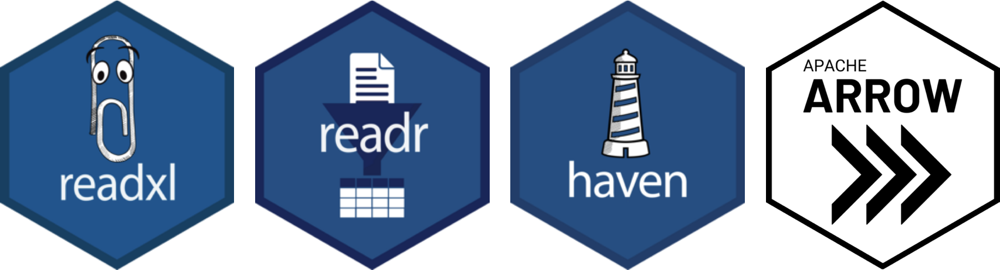{.pad style="height: 200px;"}


::: {.pad .incremental}
- `{readxl}` es uno de los paquetes de lectura de planillas Excel. Para escribir un archivo Excel está `{writexl}`
- `{readr}` lee y escribe datos de múltiples formatos (csv, rds, rdata), usualmente de forma más veloz y cómoda
- `{haven}` permite cargar archivos SPSS, Stata, y SAS
- `{arrow}` es un formato moderno de datos columnares, optimizado para grandes volúmenes y velocidad de carga, y pensado para usarse en distintos softwares
:::

----

### Carga de datos desde Excel

Probemos cargando unos datos!

::: {.boton}
<a href="https://github.com/bastianolea/curso_intro_R_gratis_v2/raw/main/datos/pobreza/estimaciones_pobreza.xlsx" target="_blank">  Descargar datos de pobreza en Excel</a>
:::


:::  {.fragment}
Cargamos los datos usando una función del paquete `{readxl}`:


```{r cargar_excel}
# cargar paquete
library(readxl) 

# cargar datos
datos <- read_excel("datos/pobreza/estimaciones_pobreza.xlsx")

# mirar datos
head(datos)
```

:::


# `{dplyr}`


:::: {.columns}
::: {.incremental .column width=70%}
- Paquete de exploración, manipulación y transformación de datos
- Sus funciones se escriben como verbos
- Las acciones se encadenan con el operador de conexión o _pipe_: `|>`

::: {.fragment}
```{r}
#| message: false
library(dplyr)
```
:::
:::

::: {.column width=30%}
{}
:::
::::

<br>

::: {.boton .fragment}
[ Ver tutorial](https://bastianolea.rbind.io/blog/r_introduccion/dplyr_intro/)
:::


----

## Funciones comunes

::: {.incremental}
- `head()`, `tail()`, `glimpse()`: vistazos a los datos
- `select()`: seleccionar columnas o variables de una tabla
- `slice()`: extraer filas de una tabla por su posición o distintos criterios
- `pull()`: extraer una columna como vector
- `filter()`: filtrar observaciones en base a condiciones personalizadas
- `distinct()`: filtrar observaciones repetidas en una o más columnas
- `count()`: conteo de casos únicos en una o más columnas
- `mutate()`: crear columnas entregando valores, funciones sobre columnas, o calculando a partir de otras columnas
:::

----


## Tutoriales de `{dplyr}`

Para que puedan repasar o guiarse con **casos básicos de uso** de `{dplyr}` con **datos reales**, dejo un par de tutoriales:

::: {.boton .pad}
[ Tutorial con datos censales ](https://bastianolea.rbind.io/blog/r_introduccion/tutorial_dplyr_censo/)
:::

::: {.boton .pad}
[ Tutorial con datos sociales](https://bastianolea.rbind.io/blog/r_introduccion/tutorial_dplyr_campamentos/)
:::

----

## Conector

::: {.boton .absolute top=0% right=0%}
[ Ver tutorial](https://bastianolea.rbind.io/blog/r_introduccion/conectores/)
:::

El conector o _pipe_ `|>` (o también `%>%`) nos permite encadenar varias funciones de forma más legible.

::: {.centrar style="font-size: 200%"}
`|>`  `%>%`
:::

::: {.fragment}
Se escribe con: 

::: {.centrar style="color: #563A74; opacity: 40%;"}
Windows:
:::

{.centrar}

::: {.centrar style="color: #563A74; opacity: 40%; margin-top:32px;"}
Mac:
:::

{.centrar}

:::


----


### Usando el conector

::: {.boton .absolute top=0% right=0%}
[ Ver tutorial](https://bastianolea.rbind.io/blog/r_introduccion/conectores/)
:::


::: {.fragment .pad}
Aplicar una función normalmente:
```{r}
#| eval: false
#| code-line-numbers: false
funcion(objeto) # a la función le pasamos un objeto
```
:::
::: {.fragment .pad}
Otra forma de hacerlo con `|>` es:
```{r}
#| eval: false
#| code-line-numbers: false
objeto |> funcion() # al objeto luego le aplicamos la función
```
:::
::: {.fragment .pad}
Luego podemos encadenar varias funciones:

```{r}
#| eval: false
#| code-line-numbers: false
objeto |> funcion() |> funcion() # al objeto le aplicamos dos funciones
```
:::
::: {.fragment .pad}
También podemos ordenar las instrucciones hacia abajo:
```{r}
#| eval: false
resultado <- objeto |> 
  funcion() |> 
  funcion()
```
:::


----


## Seleccionar y ordenar

::: {.boton .absolute top=-1% right=0%}
[ Ver tutorial](https://bastianolea.rbind.io/blog/r_introduccion/dplyr_intro/#datos)
:::

Usaremos los datos de **pobreza** del [Ministerio Desarrollo Social y Familia](https://bidat.gob.cl/directorio/Pobreza%20comunal/estimaciones-de-pobreza-comunal-2022) que vimos antes. Si no los cargaste, [descárgalos](https://github.com/bastianolea/curso_intro_R_gratis_v2/raw/main/datos/pobreza/estimaciones_pobreza.xlsx) y los cargas así:

```{r}
library(dplyr)
library(readxl)

datos <- read_excel("datos/pobreza/estimaciones_pobreza.xlsx")
```

<br>


:::: {.columns}

::: {.column .fragment}
#### Seleccionar
```{r}
datos |> 
  select(region, comuna, personas) |> 
  head()
```
::: 

::: {.column .fragment}
#### Ordenar
```{r}
datos |> 
  select(region, comuna, personas) |> 
  arrange(desc(personas)) |> 
  head()
```
:::
::::


----


## Filtrar datos

::: {.boton .absolute top=-1% right=0%}
[ Ver tutorial](https://bastianolea.rbind.io/blog/r_introduccion/dplyr_intro/#filtrar-datos)
:::

- Para filtrar, realizamos una **comparación** entre los valores de una columna y un valor específico.


::: {.fragment}
```{r}
#| message: false
library(dplyr)

datos |> 
  filter(porcentaje > 0.35) |> 
  arrange(desc(porcentaje)) |> 
  head()
```
:::


----

### Comparaciones

Podemos usar cifras u objetos para compararlas entre sí: la respuesta será `TRUE` (verdadero) o `FALSE` (falso).

:::: {.pad style="max-width: 400px;"}

::: {.fragment}
```{r}
edad >= 18
```
:::

::: {.fragment}
```{r}
minimo <- 35
edad > minimo
``` 
:::

::: {.fragment}
```{r}
año == 2024
``` 
:::

::: {.fragment}
```{r}
año != 2024
```
:::
::::


Las comparaciones son el principio que luego nos permitirá filtrar datos, crear variables, y más!

----


## Crear/modificar variables

::: {.boton .absolute top=0% right=0%}
[ Ver tutorial](https://bastianolea.rbind.io/blog/r_introduccion/dplyr_mutate/)
:::

::: {.pad}
Con `mutate()` para crear una nueva variable o columna
:::

::: {.pad}
Le aplicamos `mutate()` a un _data frame_ conectando los datos a la función con un conector (`|>` o `%>%`)
:::

:::: {.columns}
::: {.column .fragment}
```{r}
datos |> 
  select(codigo, comuna) |> 
  mutate(saludo = "hola") |> 
  head()
```
:::

::: {.column .fragment}
```{r}
datos |> 
  select(comuna, personas) |> 
  mutate(miles = personas/1000) |> 
  head()
```
:::
::::

----


## Funciones

::: {.incremental}
- Las **funciones** son pequeños programas que permiten realizar distintas operaciones.
:::

::: {.centrar .fragment}
`función(argumento = 123)`
:::

::: {.fragment}
Algunas funciones comunes:

```{r}
#| code-line-numbers: false
#| eval: false
mean() # calcular promedio
median() # calcular mediana
sum() # sumar elementos
min() # valor mínimo
max() # valor máximo
```
:::

::: aside
::: {.fragment}
Si no sabemos cómo usar una función, podemos buscar su nombre en el panel **Ayuda** de RStudio, o escribir el nombre de la función precedido de un signo de interrogación: `?funcion`
:::
:::

----

### Aplicar funciones a columnas

::: {.boton .absolute top=-2% right=0%}
[ Ver tutorial](https://bastianolea.rbind.io/blog/r_introduccion/dplyr_mutate/)
:::

::: {.fragment}
Las funciones realizan operaciones sobre todos los datos de una columna, **reemplazando** los datos existentes, o **rellenando** datos de una columna nueva.
:::

::: {.fragment}
Dependiendo de lo que queramos hacer, las funciones que apliquemos con `mutate()` pueden hacer referencia a **una o a varias** columnas:
:::

::: {.fragment}
```{r}
datos |>
  select(comuna, personas) |> 
  arrange(desc(personas)) |> 
  head() |> 
  mutate(total_personas = sum(personas)) |> # aplicada a una columna
  mutate(letras = nchar(comuna)) |> # aplicada a otra columna
  mutate(orden = row_number()) |> # hace algo por sí misma
  mutate(porcentaje = round(personas/total_personas, 2)) # función con argumento
```
:::


----

### Variables condicionales


::: {.boton .absolute top=0% right=0%}
[ Ver tutorial](https://bastianolea.rbind.io/blog/r_introduccion/dplyr_mutate/#crear-una-variable-condicional-con-if_else)
:::

:::: {.columns}
::: {.column .fragment}
#### `ifelse()`

**Si** ocurre _esto,_ **entonces** retorno _lo primero_, y **si no**, _lo segundo._
```{r}
datos |> 
  select(comuna, porcentaje) |> 
  mutate(nivel = ifelse(
    porcentaje >= 0.3,
    yes = "alta", 
    no = "baja")) |> 
  head()
```
:::

::: {.column .fragment}
#### `case_when()`
Recodificación avanzada con **múltiples condicionales**.
```{r}
datos |> 
  select(comuna, porcentaje) |> 
  mutate(miles = case_when(
    porcentaje >= 0.3 ~ "alta",
    porcentaje >= 0.2 ~ "media",
    porcentaje < 0.2 ~ "baja")) |> 
  head()
```
:::
::::


----

## Resúmenes de datos

::: {.boton .absolute top=-1% right=0%}
[ Ver tutorial](https://bastianolea.rbind.io/blog/r_introduccion/dplyr_summarize/)
:::

::: {.fragment}
Aplicar una **función** para **resumir** todas las filas de una tabla en un sólo resultado:

```{r}
datos |> 
  summarize(total = sum(personas))
```
:::

::: {.fragment}
Si **agrupamos** los datos, obtendremos una fila de resultado por cada grupo:

```{r}
datos |> 
  group_by(region) |> 
  summarize(total = sum(personas)) |> 
  head(n = 4)
```
:::


# `{ggplot2}`


:::: {.columns}
::: {.incremental .column width=70%}
- Librería de visualización de datos
- Dibuja gráficos por medio de capas
- Entre sus beneficios está su flexibilidad, adaptabilidad y reusabilidad

::: {.fragment}
```{r}
#| message: false
library(ggplot2)
```
:::
:::

::: {.column width=30%}
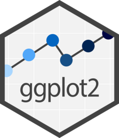{}
:::
::::

<br>

::: {.boton .fragment}
[ Ver tutorial](https://bastianolea.rbind.io/blog/r_introduccion/tutorial_visualizacion_ggplot/)
:::


----

## Gramática de gráficos


{.absolute top=10% left=-20%}

:::: {.columns}

::: {.column width="30%"}
:::

::: {.column width="70%"}

::: {style="margin-top: 20px;"}
* **Datos:** variables disponibles para construir el gráfico
* **Mapeos:** conexión de variables a distintos aspectos de la visualización
* **Capas:** elementos geométricos agregados unos sobre otros
* **Escalas:** especificación de la forma en que se mapean las variables a los ejes
* **Facetas:** dividir la visualización en paneles distintos según una variable
* **Coordenadas:** proyección de las coordenadas en el plano
* **Temas:** definición de la apariencia general del gráfico, y específica para cada elemento
:::

:::
::::


----


## Gramática aplicada al código

Por un lado tenemos los conceptos que constituyen la **gramática** de los gráficos, y por el otro un ejemplo de código aplicando estos conceptos.

:::: {.columns}

::: {.column width="40%"}

::: {style="font-align: right;"}
- Datos [línea 1]{.linea}
- Mapeos [línea 2]{.linea}
- Capas [línea 3]{.linea}
- Escalas [línea 4]{.linea}
- Facetas [línea 5]{.linea}
- Coordenadas [línea 6]{.linea}
- Temas [línea 7]{.linea}
:::

:::

::: {.column width="60%"}
```{r}
#| fig-height: 4
#| fig-width: 7
ggplot(iris) + # datos
  aes(Sepal.Width, Sepal.Length, color = Species) + # mapeos
  geom_point(size = 1) + # capas
  scale_color_discrete() + # escalas
  facet_wrap(~Species) + # facetas
  coord_cartesian(xlim = c(2, 5)) + # coordenadas
  theme_linedraw() # temas
```

:::

::::

----

## Colores del gráfico

```{r}
grafico <- ggplot(iris) +
  aes(Sepal.Width, Sepal.Length, color = Species) + 
  geom_point(size = 1)
```

:::: {.columns}

::: {.column}

##### Colores generales del gráfico
```{r}
#| fig-height: 3
#| fig-width: 4
grafico_tema <- grafico +
  theme_linedraw(paper = "#EAD2FA", 
                ink = "#553A74", 
                accent = "#9069C0")

grafico_tema
```
:::

::: {.column}

##### Colores de las categorías
```{r}
#| fig-height: 3
#| fig-width: 4
grafico_color <- grafico_tema +
    scale_color_discrete(
      palette = c("#AC558A", "#553A74", 
                  "#666BC7"))

grafico_color
```

:::
::::


----

## Temas

:::: {.columns}

::: {.column width="33%"}
##### Funciones de temas

- `theme_minimal()`
- `theme_classic()`
- `theme_void()`
- `theme_linedraw()`
:::
::: {.column width="33%"}
##### Componentes del gráfico

- `panel`
- `grid`
- `scales`
- `axis`
- `strip`
- `legend`
:::
::: {.column width="33%"}
#####  Tipos de componente
- `element_text()`, txtos
- `element_line()`, líneas
- `element_rect()`, rectángulos
- `element_blank()`, ocultar
:::
::::

----

### Personalización de temas

```{r}
#| fig-height: 5
#| fig-width: 7
#| fig-scale: 1.5
grafico_color +
  theme(panel.grid.major = element_line(linewidth = 0.5, color = "#C2A1D6"),
        panel.grid.minor = element_blank(),
        panel.background = element_rect(fill = "#DBBFEC", color = NA),
        axis.title = element_text(face = "bold"),
        axis.title.x = element_text(margin = margin(t = 8)),
        axis.text.x = element_text(angle = 90, vjust = 0.5),
        legend.position = "top",
        legend.title = element_text(face = "bold", size = 14),
        legend.text = element_text(margin = margin(l = 4)),
        legend.key = element_rect(fill = "#DBBFEC", color = "#C2A1D6"),
        legend.key.spacing.y = unit(1.8, "mm"),
        panel.spacing.x = unit(6, "mm"),
        strip.text = element_text(face = "bold.italic", size = 12))
```


----

## Extensiones de `{ggplot2}`


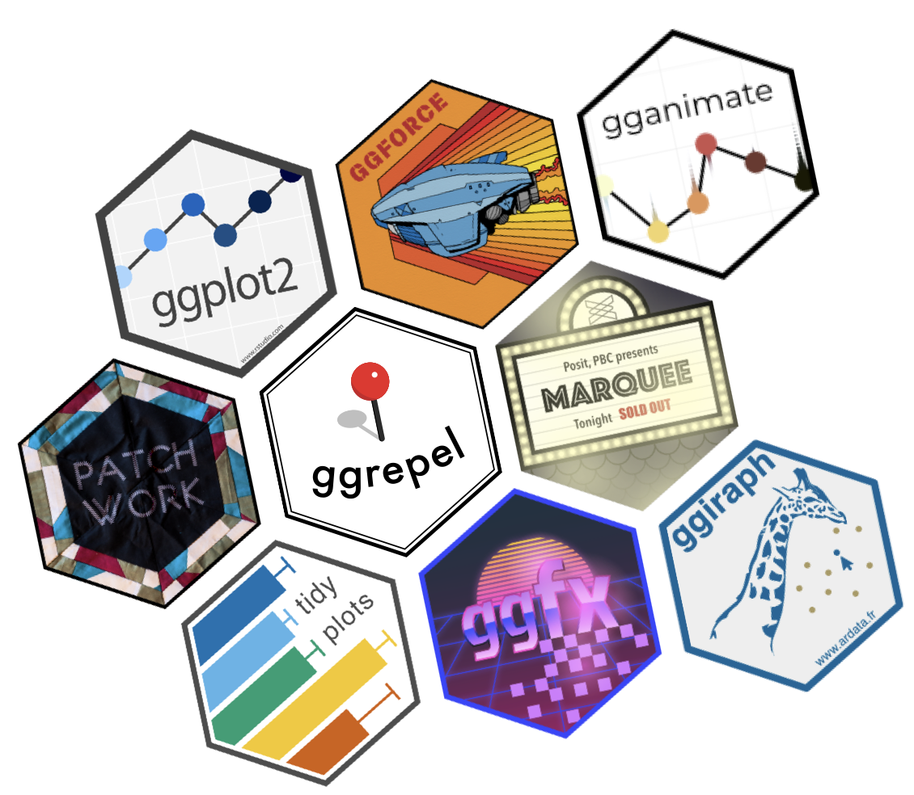{.absolute top=25% right=-15%}


Existen muchos paquetes que extienden las capacidades de `{ggplot2}`:

:::: {style="max-width: 50%;"}
::: {.incremental}
- `{ggforce}`: nuevas geometrías
- `{patchwork}`: combinación de gráficos
- `{ggrepel}`: separación de textos sobrepuestos
- `{gganimate}`: gráficos animados
- `{marquee}` y `{ggtext}`: textos con formato, color, y más
- `{ggfx}`: shaders, filtros y efectos especiales
- `{ggiraph}` y `{plotly}`: gráficos interactivos
:::
::::

::: {.aside}
Acá hay una [lista de extensiones de `ggplot2`](https://exts.ggplot2.tidyverse.org/gallery/)
:::


----


## Datos de texto {visibility=hidden}

{.esquina-der style='height:128px;'}

El paquete `{stringr}` se especializa en texto.

::: {.pad}
```{r}
library(stringr)
```

::: {.fragment}
```{r}
texto <- "todxs pueden aprender a programar 💕" 

str_detect(texto, "todos")

str_detect(texto, "aprender")
```
:::

::: {.fragment}
```{r}
datos |> 
  filter(str_detect(comuna, "Alto")) |> 
  select(region, comuna)
```
:::
:::


----

## Cruzar datos

::: {.boton .absolute top=0% right=0%}
[ Ver tutorial](https://bastianolea.rbind.io/blog/left_join/)
:::

Para cruzar dos tablas de datos<br>usamos `left_join()` de `{dplyr}`

<br>

::: {.fragment}
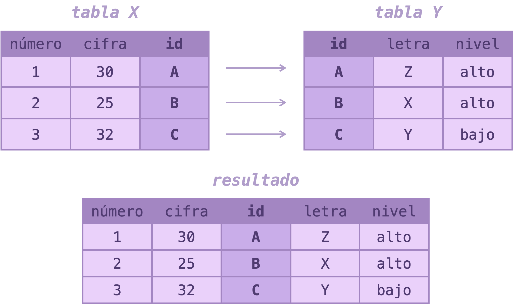{.centrar style='max-height: 400px;'}
:::

----


### Cruzando datos 

Veamos un ejemplo donde cruzamos dos tablas, la de **pobreza** y una nueva de **clasificación comunal** (urbana, mixta, rural según la [PNDR](https://bibliotecadigital.odepa.gob.cl/handle/20.500.12650/74476)), a partir de la columna que tienen en común: `codigo`

::: {.fragment}
```{r}
#| message: false
clasificacion <- readr::read_csv2("datos/clasificacion/clasificacion.csv")
```
:::

::: {.fragment}
```{r}
clasificacion_b <- clasificacion |> 
  select(codigo, clasificacion)
```
:::

::: {.fragment}
```{r left_join}
datos_clasif <- datos |> 
  select(codigo, comuna, personas, porcentaje) |> 
  mutate(codigo = as.numeric(codigo)) |>
  left_join(clasificacion_b, by = "codigo")

datos_clasif |> head()
```
:::


----


## Transformar datos

::: {.boton .absolute top=0% right=0%}
[ Ver tutorial](https://bastianolea.rbind.io/blog/r_introduccion/tidyr_pivotar/)
:::

::: {.incremental}
- El paquete `{tidyr}` se especializa en **transformar la estructura de los datos**.
- Esto nos permite **manipular** los datos para que sea más cómodo o lógico realizar ciertas operaciones.
  - Por ejemplo:
    - Si necesitamos sumar varias variables, es más cómodo tenerlas en filas (para poder usar algo como `sum(valores)`) que en columnas (y tener que sumar `a+b+c+d`...)
    - Si queremos comparar varias variables, o mostrarlas a un público, es mejor que estén lado a lado, como en las tablas comunes.
:::
  
  
----


### Transformando datos

{.esquina-der style='height:128px;'}

- **Pivotar** una tabla sirve para cambiar su forma:
  - De variables en columnas a filas: `pivot_longer()`
  - De variables en filas a columnas: `pivot_wider()`


::: {.fragment}
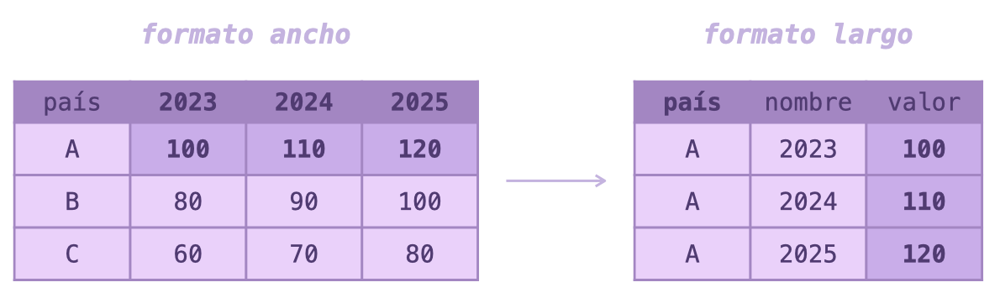{.centrar style='max-height: 200px;'}
:::

::: {.fragment}
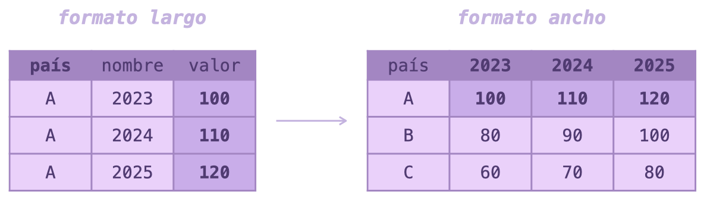{.centrar style='max-height: 200px;'}
:::

----


## Datos para practicar 


::: {.boton}
[ Estimaciones de población Censo](https://raw.githubusercontent.com/bastianolea/curso_intro_R_gratis_v2/refs/heads/main/datos/estimaciones/estimaciones-y-proyecciones-base.xlsx)
:::


::: {.boton }
[ Variables educacionales Censo 2024](https://github.com/bastianolea/curso_intro_R_gratis_v2/raw/main/datos/censo/P7_Educacion.xlsx)
:::

::: {.boton }
[ Estimación de pobreza multidimensional 2022](https://github.com/bastianolea/curso_intro_R_gratis_v2/raw/main/datos/pobreza/estimaciones_indice_pobreza_multidimensional_comunas_2022.xlsx)
:::

::: {.boton }
[ Clasificaciones comunales 2024](https://github.com/bastianolea/curso_intro_R_gratis_v2/raw/main/datos/clasificacion/ClasificacionComunasPNDR_Censo2024.xlsx)
:::

Puedes encontrar más datos en mi [repositorio de datos sociales](https://bastianolea.github.io/datos_sociales/), en el [banco integrado de datos del Ministerio de Desarrollo](https://bidat.midesof.cl/), en los [datos abiertos del Estado Chile](https://datos.gob.cl/), y [muchos más](https://bastianolea.rbind.io/blog/r_introduccion/recursos_r/#datos).

:::: aside 
::: {.fragment}
Ahora que ya sabes lo básico, todo lo demás se trata de aprender piezas y herramientas que puedes ir agregando a tus análisis! 🧩🛠️
:::
::::


----

## Consejos 

::: {.incremental}
- Mantengan su propio **libro de aprendizajes** 📝
- Lean bien los **errores** y busquen su significado
- Si algo sale mal, prueben **paso a paso** 
- También pueden devolverse y **empezar de nuevo**
- Dense una vuelta y a veces la respuesta llega solita 😌
- No se vuelvan dependientes de la IA 😵
  - Si quieren usar IA: 
    - **Autocompletado** de GitHub Copilot
    - **Mensaje de sistema** para su proveedor de IA
- Aprendendan a **buscar** bien en internet
- Compartan lo que hacen y socialicen sus aprendizajes! ✨
:::


# Gracias <span style="font-size: 110%; color: #9F69C7;">♥</span>


Puedes escribirme cualquier duda o comentario [por aquí](https://bastianolea.rbind.io/contacto/)

<br>


:::: {.centrar}
::: {.boton}
[ Aprende R](https://bastianolea.github.io/aprende_r/)
:::

::: {.boton}
[ Curso](https://bastianolea.rbind.io/clases/curso_gratis_r_intro_2/)
:::

::: {.boton}
[ Código](https://github.com/bastianolea/curso_intro_R_gratis_v2)
:::

::: {.boton}
[ Grabaciones](https://bastianolea.rbind.io/blog/curso_gratis_r_intro_2/#streaming)
:::
::::

