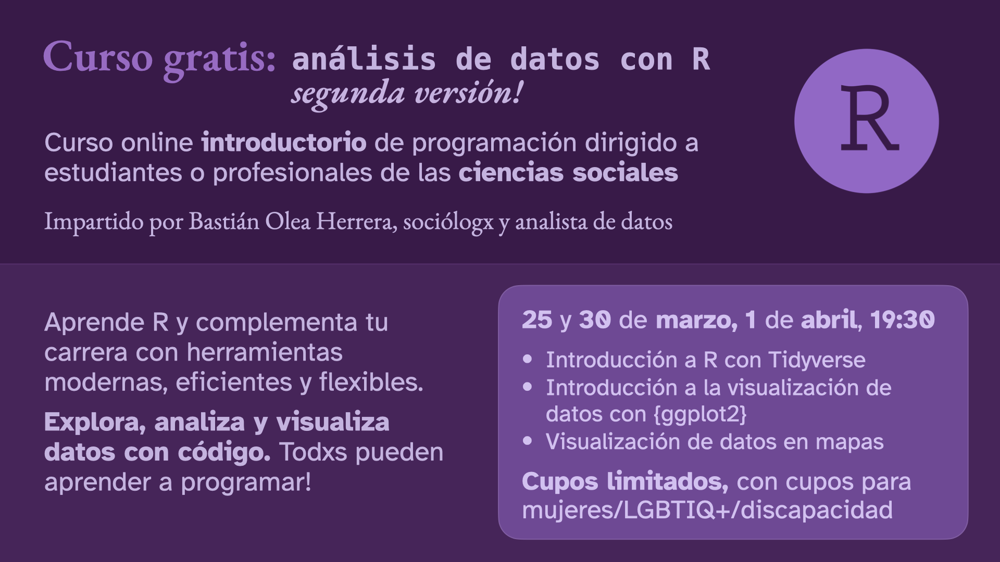

## Curso gratuito: introducción al análisis de datos con R, segunda versión

Información e inscripciones: https://bastianolea.rbind.io/blog/curso_gratis_r_intro_2/

Segundo curso gratuito de introducción a R enfocados en ciencias sociales. En este curso, de tres sesiones, aprenderemos a usar R para **analizar datos sociales**, aprenderemos lo básico de la **visualización de datos**, y exploraremos la **creación de mapas** con R.

_Recomiendo revisar los [contenidos del primer curso gratuito de R](https://bastianolea.rbind.io/blog/curso_gratis_r_intro_1/) que organicé, incluyendo grabaciones y diapositivas, para tener una base de conocimientos básicos!_

En este curso gratuito de R podrás **aprender desde cero** a usar programación para análisis de datos! 

R es un lenguaje diseñado para trabajar con datos. Además de exploración, transformación y análisis de datos, R permite hacer visualizaciones, animaciones, automatización de procesos, reportes, aplicaciones web, y mucho más. 

Su gracia es que es un lenguaje usado por personas de **diversas disciplinas**, y por lo mismo es un lenguaje orientado a ser usado por personas que no sean expertas en informática o ciencias de la computación.

Aprende **desde cero** a usar este lenguaje y complementa tu carrera con herramientas de programación que te abrirán muchas posibilidades. 

El curso va dirigido a **profesionales o estudiantes de las ciencias sociales** con **poca experiencia** programando, o **alguna experiencia** trabajando con datos.

Los **cupos** son limitados, y se aplicarán **criterios de inclusión** para la participación de grupos minoritarios (mujeres, disidencias de sexo y género, personas con discapacidad).

Las clases serán **online** los días 25 y 30 de marzo, y 1 de abril a las 7:30PM (horario de Chile).

[Más información en este post](https://bastianolea.rbind.io/blog/curso_gratis_r_intro_2/)

## Código de conducta

Este cursos y sus materiales son parte del [código de conducta Contributor Covenant](https://contributor-covenant.org/version/2/1/CODE_OF_CONDUCT.html). Al participar de este proyecto, aceptas cumplir con sus términos.